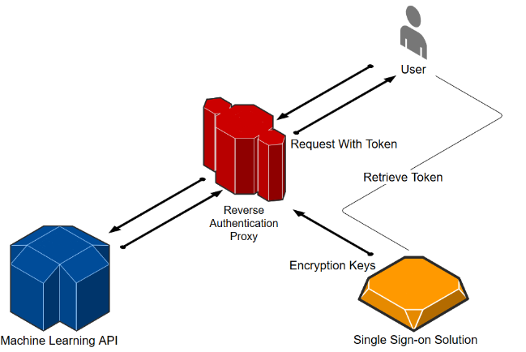

# ooproxy

A reverse OpenID Connect and OAuth 2 proxy, implementing the client-credentials flow (machine-to-machine authentication/authorization). It can be used to protect http-based APIs with an authentication mechanism. Because it only supports the client-credentials flow, there are no redirects when the authentication fails, and only bearer tokens are supported in the authorization header. 

The proxy has the following advantages:
* Low resource usage (CPU / Memory), small docker image
* Doesn't put a lot of strain on the SSO server, will only retrieve new keys on the first request, when keys are rotated and on an optional timeout

The proxy supports the following algorithms:

* RS256
* RS384
* RS512
* HS256
* HS384
* HS512



## Configuration

The proxy can be configured through environment variables:

* LISTEN_URL -> The url the proxy listens on
* LISTEN_SSL_URL -> The SSL url the proxy listens on (if this is set, also configure CERT_FILE)
* PROVIDER_URL -> The OpenID connect provider root url, no trailing slashes
* UPSTREAM_URL -> The upstream url for the proxy (the resource it's protecting)
* CLIENT_SECRET -> The OpenID client secret (optional, necessary when using symmetric token encryption algorithms)
* KEY_EXPIRY_SECS -> Check for new jkws keys every x seconds (optional, defaults to no timeout)
* UPSTREAM_TIMEOUT_SECS -> Requests to upstream timeout after x seconds (optional, defaults to 1 hour)
* AUDIENCE -> Validate that the "aud" claim matches this value (optional, not validated when not provided). Since the aud claim can be either an array, or a single string, the configuration must be in json format. Use ["a", "b"] if you want to validate it as an array, or "c" if you want to validate that it's that exact value.
* SUBJECT -> Validate that the "sub" claim matches this value (optional, not validated when not provided)
* LEEWAY -> The amount of clock skew in seconds that is allowed to occur when validating tokens (optional, defaults to 0)
* NUM_WORKERS -> Number of threads (optional, defaults to two)
* CERT_FILE -> A pfx SSL certificate (optional, needs to be configured if listen_ssl_url is configured)
* CERT_PASSWORD -> A password to decrypt the certificate (optional)
* RUST_LOG -> Either error, warning, info, debug or all (optional, for enabling logging)

It also supports loading a configuration from a settings.toml file in $PATH:

```
listen_url = "0.0.0.0:8080'
listen_ssl_url = '0.0.0.0:4443'
cert_file = 'cert.pfx'
cert_password = 'hunter2'
upstream_url = 'http://upstream.com'
provider_url = 'https://my-identity.com'
client_secret = 'secret'
key_expiry_secs = 3600
upstream_timeout_secs = 120
audience = '"my-api"'
subject = 'my-user'
leeway = 3
num_workers = 8
```

## Run

Run from [docker](https://hub.docker.com/r/hal24000/ooproxy/):

`docker run -e LISTEN_URL=0.0.0.0:80 -e PROVIDER_URL=https://identity -e CLIENT_SECRET=secret -e UPSTREAM_URL=https://upstream/ -e RUST_LOG=info -e KEY_EXPIRY_SECS=3600 -e UPSTREAM_TIMEOUT_SECS=60 -e NUM_WORKERS=4 -e AUDIENCE='\"myproxy\"' -e SUBJECT=myuser -e LEEWAY=2 -e CERT_FILE=cert.pfx -e CERT_PASSWORD=hunter2 hal24000/ooproxy:lastest`

Run outside docker (after building, use a settings.toml file):

`ooproxy`

## Build

If you want to run the proxy inside docker:

`docker build . -t ooproxy --build-arg features=`

For a docker image with TLS use:

`docker build . -t ooproxy --build-arg features=tls`

Or, if you want to run the proxy outside of docker:

`cargo install ooproxy`

With TLS:

`cargo install ooproxy --all-features`

## How to authenticate

To authenticate to your APIs, use the client credentials flow, using the correct credentials for the client (indicated by client and secret). Example with curl:

* Get a token from your identity server: curl -X POST -d "client_id=client&client_secret=secret&grant_type=client_credentials" https://identity/connect/token
* Authenticate with token: curl -H "Authorization: Bearer ey..." "https://proxy/my/url

## Copyright

HAL 24000 B.V. 2018